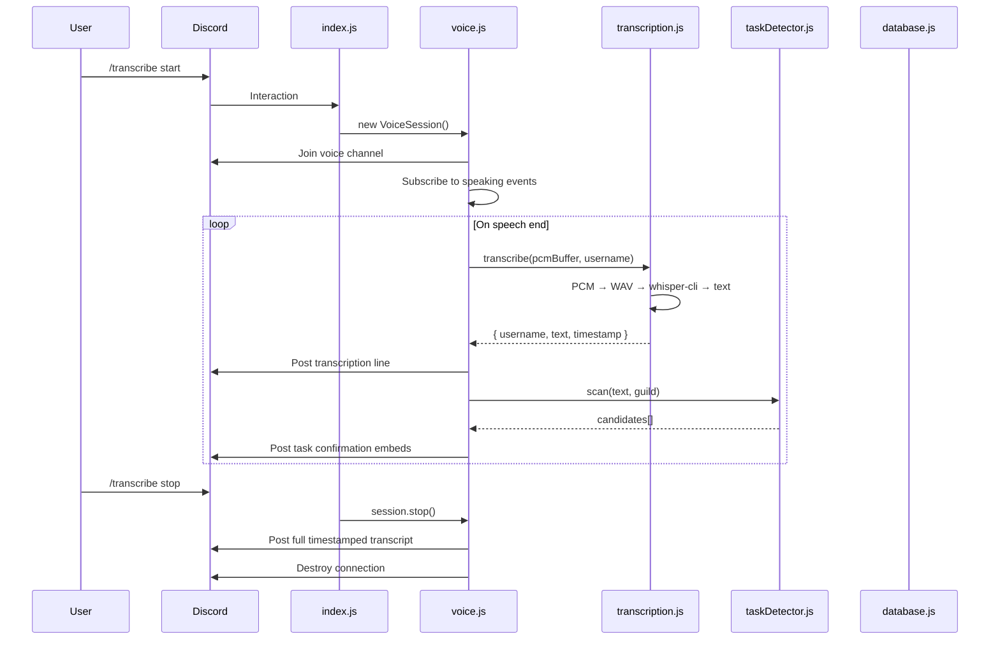
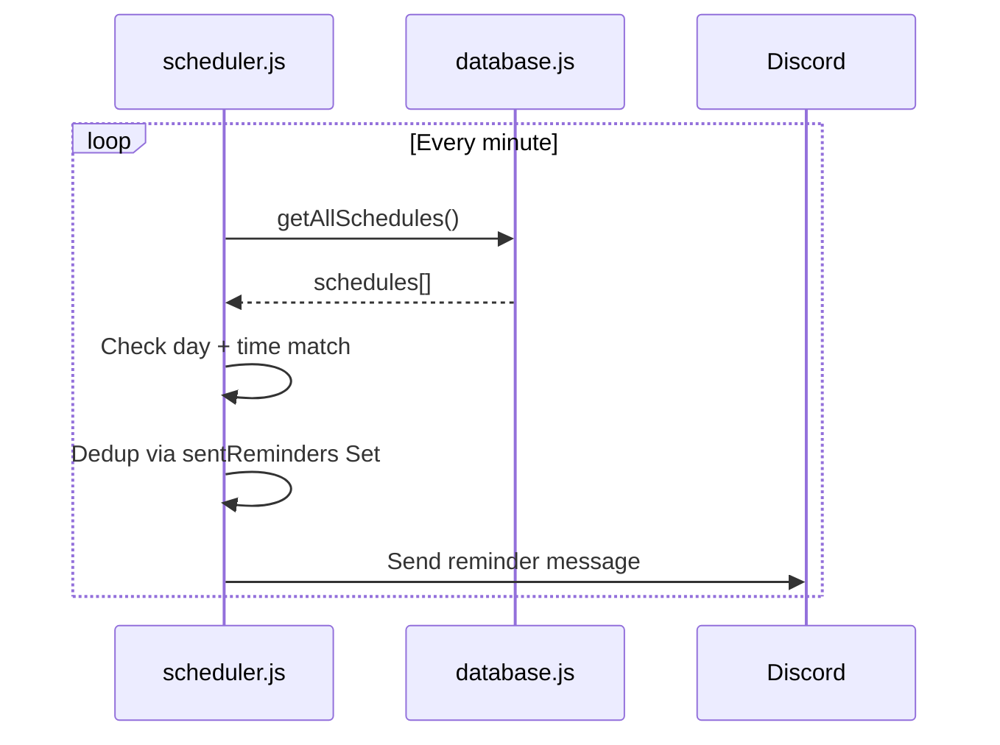
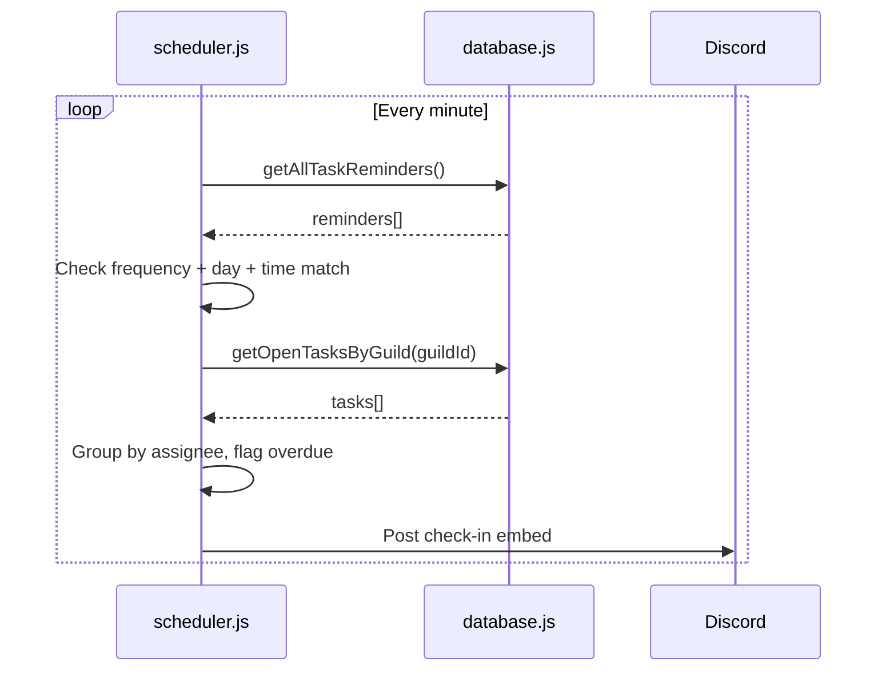
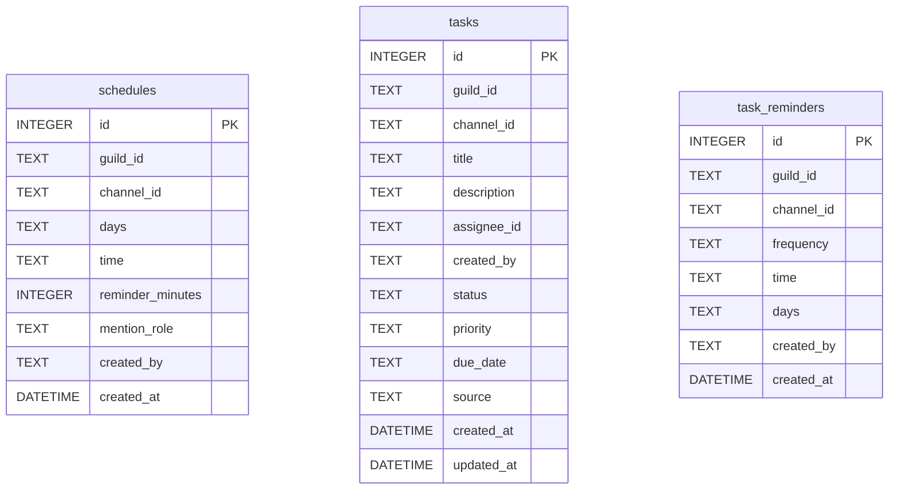

# Architecture

## Overview

Discord PMO Bot is a single-process Node.js application using discord.js v14. It connects to Discord's gateway, handles slash commands and component interactions, and runs background cron jobs for reminders.

## Module Responsibilities

```
src/
  index.js              Entry point — client setup, interaction routing
  config.js             Validates and exports env vars (token, client ID, whisper paths)
  commands/
    transcribe.js       /transcribe start|stop — voice session lifecycle
    schedule.js         /schedule set|list|edit|remove — meeting reminder CRUD
    task.js             /task create|list|edit|status|view|delete — task CRUD + pagination
    taskReminder.js     /task-reminder set|list|remove — check-in reminder CRUD
    deploy.js           Registers slash commands with Discord API (run separately)
  services/
    voice.js            VoiceSession class — joins channel, captures audio, flushes transcriptions
    transcription.js    Shells out to whisper-cli, manages temp WAV files
    database.js         SQLite via better-sqlite3 — all CRUD operations
    scheduler.js        Cron-based reminder engine (meetings + task check-ins)
    taskDetector.js     Regex pattern matching on transcript text, confirmation UI
  utils/
    audio.js            PCM buffering (UserAudioBuffer) and WAV header construction
```

## Data Flow

### Voice Transcription



### Meeting Reminders



### Task Check-In Reminders



## In-Memory State

The bot maintains four in-memory structures. All are lost on restart.

| Variable | Location | Type | Key | TTL | Purpose |
|----------|----------|------|-----|-----|---------|
| `sessions` | `voice.js` | `Map<guildId, VoiceSession>` | Guild ID | Session lifetime | Active transcription sessions (max 1 per guild) |
| `paginationState` | `task.js` | `Map<messageId, { filters, page, total }>` | Message ID | 10 minutes | Preserves list filters across page navigation |
| `pendingCandidates` | `taskDetector.js` | `Map<candidateId, candidateData>` | UUID | 5 minutes | Detected tasks awaiting user confirmation |
| `sentReminders` | `scheduler.js` | `Set<string>` | `{id}-{date}-{timestamp}` | 24 hours | Deduplication for reminder sends |

## Database Schema

SQLite with WAL mode. Database file: `data/bot.db`.



### Column Notes

- **tasks.status**: `todo` | `in_progress` | `in_review` | `done` | `cancelled`
- **tasks.priority**: `low` | `medium` | `high` | `critical`
- **tasks.source**: `manual` (slash command) | `auto` (transcript detection)
- **schedules.days**: Comma-separated lowercase day names (e.g., `monday,wednesday,friday`)
- **task_reminders.frequency**: `daily` | `weekly`
- **task_reminders.days**: Comma-separated (weekly only, e.g., `monday,friday`)

## Timezone

All time handling uses **Asia/Manila (PHT, UTC+8)**. Hardcoded in `scheduler.js`.

## Dependencies

| Package | Purpose |
|---------|---------|
| `discord.js` | Discord API client |
| `@discordjs/voice` | Voice connection and audio receive |
| `better-sqlite3` | SQLite database driver |
| `node-cron` | Cron-based job scheduling |
| `prism-media` | Opus decoding for voice audio |
| `opusscript` | Opus codec bindings |
| `tweetnacl` | Audio encryption for Discord voice |
| `dotenv` | `.env` file loading |

## External Binary

**whisper.cpp** (`whisper-cli`) — called as a child process for speech-to-text. Path configured via `WHISPER_CPP_PATH` and `WHISPER_MODEL_PATH` env vars. Uses 4 threads, auto language detection, 30-second timeout.
